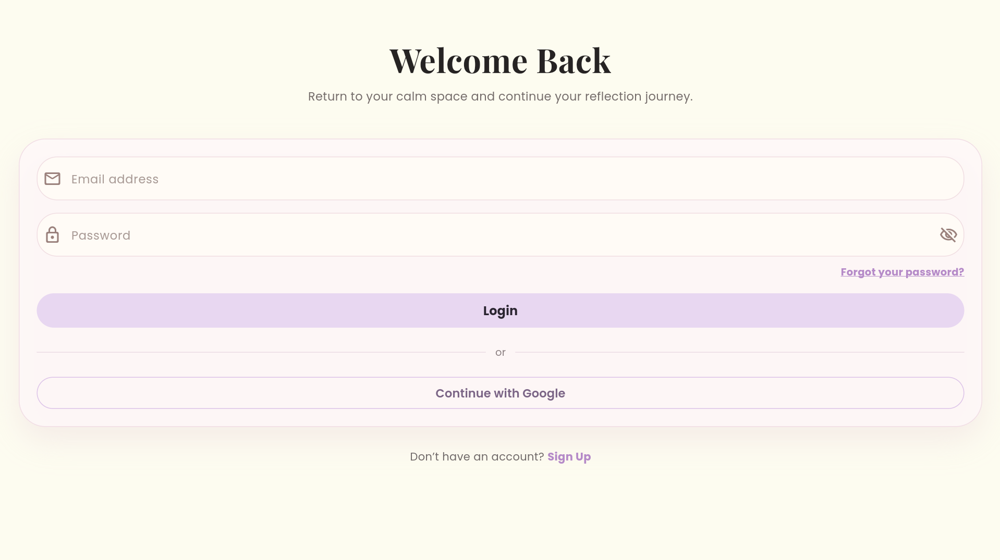
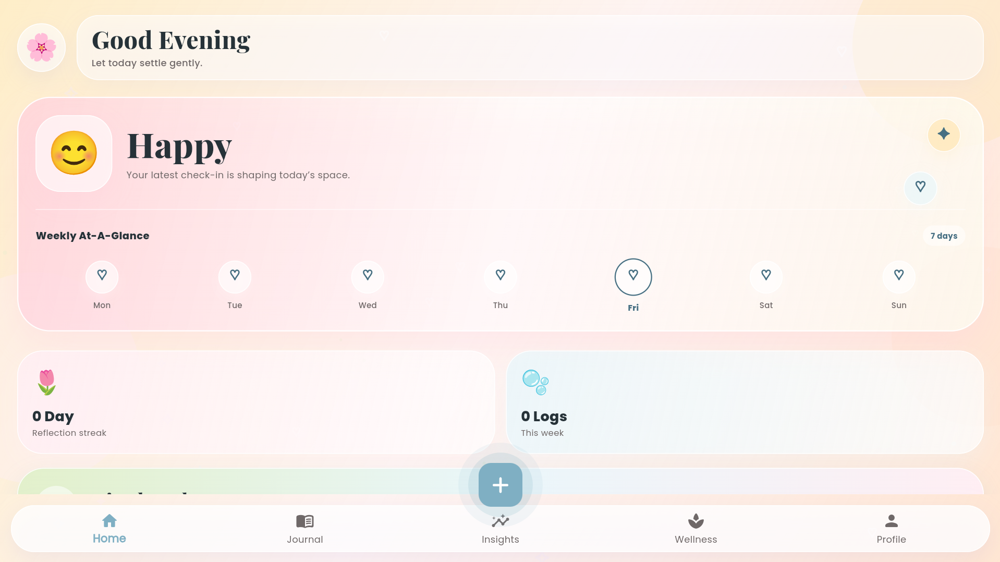
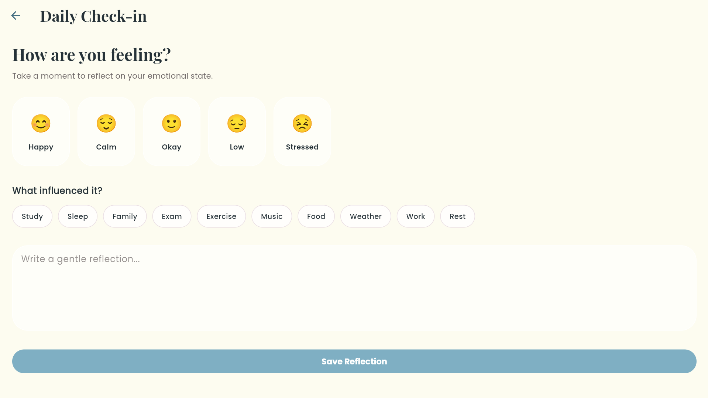
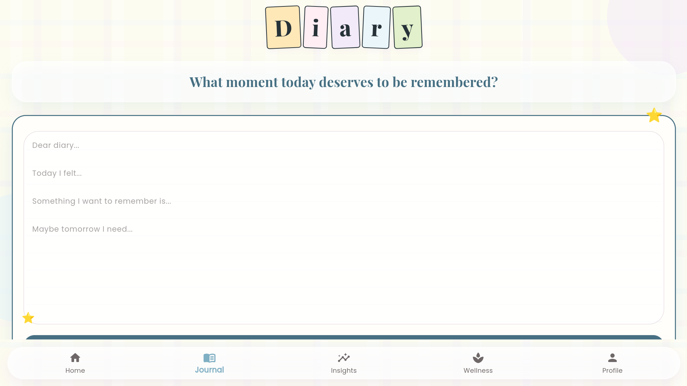
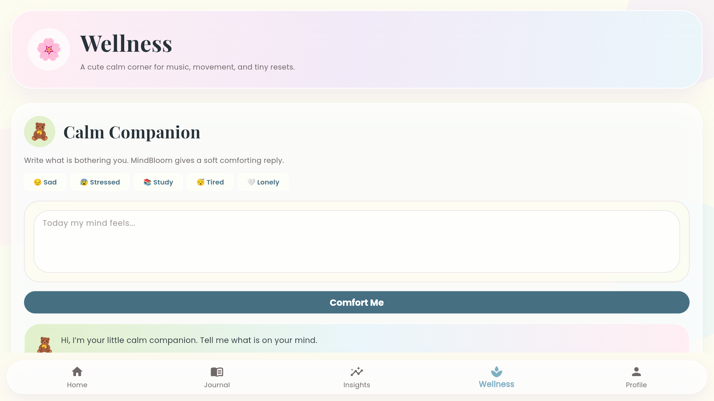
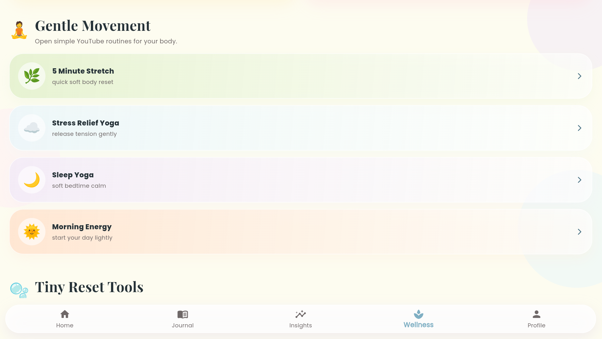

# MindBloom 🌸

MindBloom is a Flutter-based mood tracking and mental wellness application designed to help users understand their emotions, record personal reflections, and access supportive wellness tools in one place.

The application combines mood tracking, journaling, guided wellness activities, Firebase authentication, cloud data storage, notifications, and an AI-powered comfort companion.

## Features

- Secure user registration and login
- Firebase password recovery
- Daily mood tracking
- Mood history and calendar view
- Personal journal entries
- AI Comfort Companion
- Guided breathing exercises
- Grounding activities
- Water reminder feature
- Wellness support tools
- User profile management
- Dark mode support
- Local notifications
- Responsive Android and Web layouts

## Technologies Used

- Flutter
- Dart
- Firebase Authentication
- Cloud Firestore
- Firebase Core
- Gemini API
- SharedPreferences
- Flutter Local Notifications
- TableCalendar
- Provider
- Android Studio
- Git and GitHub

## Screenshots

The application screenshots are stored in:

```text
assets/screenshots/
```

| Login | Home                                          | Mood Tracker |
|---|-----------------------------------------------|---|
|  |  |  |

| Journal | AI Comfort Companion                                        | Wellness Hub                                        |
|---|-------------------------------------------------------------|-----------------------------------------------------|
|  |  |  |

## Project Structure

```text
lib/
├── core/
├── features/
├── models/
├── screen/
├── services/
├── widgets/
├── firebase_options.dart
└── main.dart
```

The exact folder structure may vary as the application continues to develop.

## Getting Started

### Prerequisites

Install the following tools before running the project:

- Flutter SDK
- Dart SDK
- Android Studio or Visual Studio Code
- Git
- A Firebase project
- An Android emulator or physical Android device

Check the Flutter installation:

```powershell
flutter doctor
```

## Installation

Clone the repository:

```powershell
git clone <your-repository-url>
```

Move into the project folder:

```powershell
cd mood_tracker
```

Install the required dependencies:

```powershell
flutter pub get
```

Run the application:

```powershell
flutter run
```

Replace `<https://github.com/aryalsadikshya/mood_tracker>` with the actual GitHub repository URL.

## Firebase Setup

MindBloom uses Firebase for authentication and cloud data storage.

To configure Firebase:

1. Create a Firebase project.
2. Add an Android or Web application.
3. Enable Firebase Authentication.
4. Enable Cloud Firestore.
5. Configure the project using FlutterFire CLI.
6. Generate `firebase_options.dart`.
7. Add `google-services.json` to the Android project.

Do not commit private service-account credentials, signing keys, environment files, or secret API keys.

## Gemini Configuration

The AI Comfort Companion uses the Gemini API to generate supportive responses.

For production use, Gemini requests should be handled through a secure backend or cloud function. Private API keys should not be permanently embedded inside the Flutter client application.

## Running on Android

Run the application on a connected Android device:

```powershell
flutter run -d <device-id>
```

Create a release APK:

```powershell
flutter build apk --release
```

The generated APK will be available at:

```text
build/app/outputs/flutter-apk/app-release.apk
```

## Running on Web

Run the application in Chrome:

```powershell
flutter run -d chrome
```

Create a release Web build:

```powershell
flutter build web --release
```

The generated Web files will be available at:

```text
build/web/
```

## Code Quality

Format the project files:

```powershell
dart format .
```

Run Flutter static analysis:

```powershell
flutter analyze
```

Expected result:

```text
No issues found!
```

## Security and Privacy

MindBloom may process personal information such as moods, journal entries, profile details, and wellness interactions.

The project includes measures such as:

- Firebase Authentication
- Firestore access control
- Protected development credentials
- `.gitignore` rules for sensitive files
- Friendly error handling
- Input validation
- Secure password recovery
- Restricted access to user data

Users should avoid entering highly sensitive personal or medical information into demonstration builds.

## Future Improvements

- Secure backend integration for Gemini
- Firebase App Check
- Improved Firestore Security Rules
- Cloud backup and synchronization
- Additional accessibility options
- More wellness exercises
- Improved mood insights
- Automated testing
- Multi-language support
- Google Play Store publication

## Project Purpose

MindBloom was developed as a portfolio and learning project during the `#111DaysOfLearningForChange` challenge.

The project demonstrates practical experience with Flutter development, Firebase integration, responsive design, accessibility, application security, user experience, and AI-assisted features.

## Disclaimer

MindBloom is a wellness support application and is not a replacement for professional medical or mental health care.

## Author

Developed as part of a Flutter and mobile application development learning journey.

## License

This project is intended for educational and portfolio purposes.


## Demo

Watch the MindBloom web application demonstration:

[View MindBloom Demo](https://drive.google.com/file/d/1vrdgeqSTig4rzNKkDux2VPT8kpGkJTdL/view?usp=drive_link)
